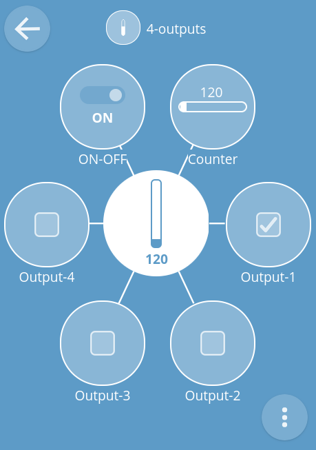
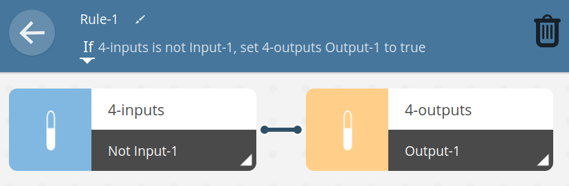

# IoT Thing: 4 outputs with counter

## Introduction

This is web connected 4 outputs module.

## Dependencies

Requires:

 * [Web Thing Server](https://github.com/KrzysztofZurek1973/iot_components/tree/master/web_thing_server)

## Features

4 outputs webThing has @type `MultiLevelSwitch` and the following properties:

* **Output-1** up to **Output-4**, allows to set output high (checked) or low (not checked), @type: `BooleanProperty`
* **counter**, shows how many times outputs has been changed, max = 1000, @type: `LevelProperty`
* **ON-OFF**, ON: at least one output is high, @type: `OnOffProperty`

## Documentation

How to start the node see [iot_web_thing_example](https://github.com/KrzysztofZurek1973/iot_web_thing_example#power-up).

### Configuration

GPIO number can be set in `idf.py menuconfig -> Outputs config` (see [iot_web_thing_example](https://github.com/KrzysztofZurek1973/iot_web_thing_example)).

Default output GPIOs:

* OUTPUT-1: GPIO18
* OUTPUT-2: GPIO19
* OUTPUT-3: GPIO21
* OUTPUT-4: GPIO22

### Gateway web interface

To trigger an action in another webThing (e.g. set output-1 in `4-outputs` high when input-1 drops low) use Gateway rule:

## Source Code

The source is available from [GitHub](https://github.com/KrzysztofZurek1973/webthing-4-outputs).

## Links

* [WebThing Gateway](https://webthings.io/gateway/) - https://webthings.io/gateway/
* [Web Thing API](https://webthings.io/api/) - https://webthings.io/api/
* [esp-idf](https://github.com/espressif/esp-idf) - https://github.com/espressif/esp-idf

## License

The code in this project is licensed under the MIT license - see LICENSE for details.

## Authors

* **Krzysztof Zurek** - [kz](https://github.com/KrzysztofZurek1973)

